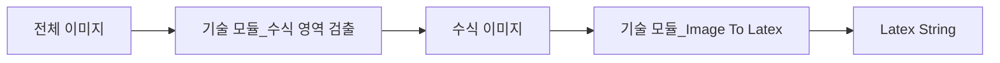

# 서비스 향 **AI** 모델 개발하기

#### 연구 관점 AI 개발

정해진 데이터셋/평가 방식에서 더 좋은 모델 찾는 일

#### 서비스 관점 AI 개발

- 학습 데이터, 테스스 데이터셋과 테스트 방법 없이, 서비스 요구 사항만이 존재

- **학습 데이터셋 준비**: 서비스 요구사항으로부터 학습 데이터셋의 **종류, 수량, 정답** 정함

- 학습데이터에서 정답: AI 모델 별로 입력에 대한 출력 쌍

  => AI 모델 하나에 대한 정답, 모델 설계와 맞물려 있음

​		=> 모델 파이프 라인 설계 요구 => 어느 정도 데이터 요구 => 반복 수렴

- **테스트 데이터셋 준비**: 학습 데이터에서 일부 사용, 서비스 요구사항으로부터 테스트 방법 도출 필요

- **offline 테스트**

  실 서비스 적용 전에 개발 환경에서의 정량 평가

- **online 테스트**

  실 서비스 적용 시에 정량 평가

=> offline 테스트 결과, online 테스트 결과 유사 => offline 테스트 잘 설계

|               | offline (서비스 적용 전, 성능 평가)                       | online (서비스 적용 시, 성능 평가)                |
| ------------- | --------------------------------------------------------- | ------------------------------------------------- |
| **정량 평가** | 완벽하지 않기 때문에 AI 모델 후보 선택 목적으로 활용      | 해당 AI 모델을 서비스 시나리오에서 자동 정량 평가 |
| **정성 평가** | 각 후보 AI 모델에 대한 면밀 분석 후 서비스 출시 버전 선택 | VOC (Voice Of Customer) AI 모델 개선 포인트 파악  |

- **처리 시간**

  처리 시간은 하나의 입력이 처리되어 출력이 나올 때까지의 시간

  - OFFLINE TEST : 이미지 입력 후 수식 영역 정보가 출력될 때까지의 시간
  - ONLINE TEST : 이미지 촬영 후 이미지에서 수식 영역 정보가 화면 상에 표현되기까지의 시간

- **목표 정확도**

  해당 기술 모듈의 정량적인 정확도

  - OFFLINE TEST : 입력된 이미지 내 카드 번호/유효기간에 대한 EDIT DISTANCE

  - ONLINE TEST : 사용자가 AI 모델의 결과값을 수정할 확률

- **목표 qps**

  > **QPS, Queries Per Second**: 초당 처리 가능한 요청 수

  향상 방법

  - 장비 늘리기: N대를 늘리면 QPS가 N배 올라간다.
  - 처리 시간 줄이기: AI 모델의 처리 속도가 N배 올라가면 QPS도 N배 올라간다.
  - 모델 크기 줄이기:  한 GPU에 올라가는 모델 수가 N배가 되면, QPS도 N배 올라간다.

- **장비 사양**

- **Serving 방식**

  기술 모듈이 Mobile, Local Cpu/Gpu Server, Cloud Cpu/Gpu Server에서 동작하기 원하는지

 

- **Data Curator**

  학습 데이터 준비(외주 업체 대응, 작업 가이드 문서, QnA 대응), 정량 평가 수립, 정성 평가 분석

- **IDE Developer**

  라벨링 툴 개발, 모델 분석 툴 개발, 모델 개발 자동화, 파이프 라인 개발

- **Modeler**

  AI 구조 제안, AI 모델 성능 분석/디버깅

