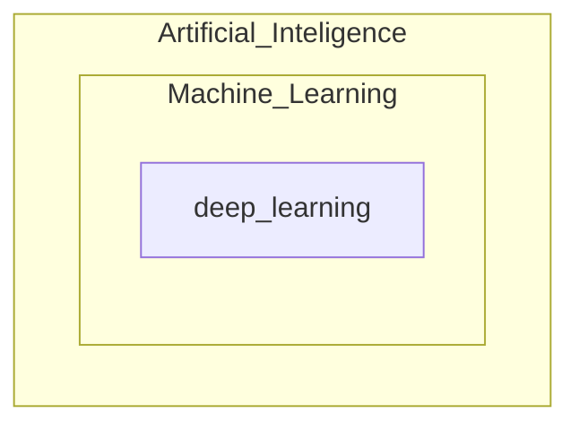

# Historical Review

- Key Components of Deep Learning

  - The **data** that the model can learn from
  - The **model** how to transform the data
  - The **loss** function quantifies the badness of the model
  - The **algorithm** to adjust the parameters to minimize the loss

- Data

  Classification, Semantic Segmentation, Detection, Pose Estimation, Visual QnA

- Model

  AlexNet, GoogLeNet, ResNet, DenseNet, LSTM, Deep AutoEncoders, GAN

- Loss functions

  a proxy of what we want to achieve 

  - Regression Task

    $ \mathrm{MSE}=\frac{1}{N} \sum_{i=1}^{N} \sum_{d=1}^{D}\left(y_{i}^{(d)}-\hat{y}_{i}^{(d)}\right)^{2}$​

  - Classification Task

    $\mathrm{CE}=-\frac{1}{N} \sum_{i=1}^{N} \sum_{d=1}^{D} y_{i}^{(d)} \log \hat{y}_{i}^{(d)}$​

  - Probabilistic Task

    $\mathrm{MLE}=\frac{1}{N} \sum_{i=1}^{N} \sum_{d=1}^{D} \log \mathcal{N}\left(y_{i}^{(d)} ; \hat{y}_{i}^{(d)}, 1\right) \quad(=\mathrm{MSE})$​​

- Algorithm

  Dropout, Early stopping, k-fold validation, Weight decay, Batch normalization, MixUp, Ensemble, Bayesian Optimization

- 2012 - AlexNet

- 2013 - DQN

- 2014 - Encoder/Decoder, Adam

- 2015 - GAN, ResNet

- 2017 - Transformer

- 2018 - BERT(Bidirectional Encoder Representations from Transformers) (fine-tuned NLP models)

- 2019 - Big Language Models(GPT-X)

- 2020 - Self-Supervised Learning

